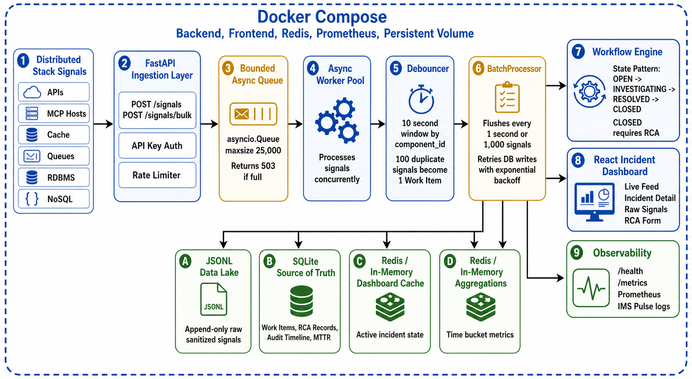

# Mission-Critical Incident Management System

This is my submission for the Infrastructure / SRE Intern assignment. I built an Incident Management System that can ingest high-volume failure signals, group noisy alerts into incidents, store raw and structured data separately, and drive an incident through RCA and closure.

The project is split into:

- `backend/` - FastAPI, asyncio workers, storage, workflow logic, metrics, tests
- `frontend/` - React + Vite incident dashboard
- `docs/` - design notes, benchmark notes, rubric mapping, prompt/context files
- `sample-data/` - sample failure event data

GitHub repository:

```text
https://github.com/tsj2003/Incident-Command
```

## Architecture



The main flow is:

```text
Distributed Signals
  -> FastAPI Ingestion
  -> API Key Middleware
  -> Rate Limiter
  -> Bounded asyncio Queue
  -> Async Worker Pool
  -> Debouncer
  -> Alerting Strategy
  -> BatchProcessor
  -> JSONL / SQLite / Cache / Aggregations
  -> React Dashboard + Prometheus
```

## Tech Stack

Backend:

- Python 3.14
- FastAPI
- asyncio
- Pydantic
- SQLite
- JSONL
- SQLAlchemy Core table schemas
- prometheus-client
- pytest
- Uvicorn

Frontend:

- React 19
- Vite
- lucide-react
- CSS

Runtime:

- Docker Compose
- Redis in the production compose profile
- Prometheus in the production compose profile
- Named Docker volume for SQLite and JSONL persistence

## Why I Chose This Design

The assignment is mainly about handling high-volume signals without crashing and without creating duplicate incidents.

For that reason, the ingestion path does not write every signal directly to disk. Signals first go into a bounded queue. Workers process them asynchronously. Raw records are then written through a batcher.

The important parts are:

- `asyncio.Queue(maxsize=25000)` prevents unbounded memory growth.
- If the queue is full, the API returns `503`.
- `BatchProcessor` flushes every `1 second` or `1,000 signals`.
- Signals with the same `component_id` inside a 10 second window are debounced into one work item.
- Every raw signal is still stored in the JSONL audit log.
- Work items and RCA records are stored transactionally in SQLite.
- Dashboard state is served from a hot cache instead of repeatedly scanning the source of truth.

## Backpressure

Backpressure is handled with a bounded queue:

```text
asyncio.Queue(maxsize=25000)
```

If the queue fills up, the system rejects new ingestion with:

```text
503 Service Unavailable
```

This is intentional. It is better to push pressure back to callers than to keep accepting data until the process runs out of memory.

There is also a fixed-window rate limiter:

```text
5,000 signals per IP per minute
```

If that limit is crossed, the API returns:

```text
429 Too Many Requests
```

## Batching

At 10,000 signals/sec, writing each signal individually to SQLite would create lock contention. I used a `BatchProcessor` so the hot path only appends to memory and flushes in groups.

Flush conditions:

- `1,000` signals in the buffer
- or `1 second` elapsed

JSONL is used for the raw data lake because append-only writes are simple and fast for a single-node audit log.

Before writing to JSONL, sensitive values such as internal IPs, bearer tokens, API keys, passwords, and secret-like fields are redacted.

## Design Patterns

Alerting uses the Strategy pattern:

- RDBMS -> P0
- MCP Host -> P1
- Cache / Queue -> P2

File:

```text
backend/app/alerting.py
```

Incident workflow uses the State pattern:

```text
OPEN -> INVESTIGATING -> RESOLVED -> CLOSED
```

`CLOSED` requires a complete RCA.

File:

```text
backend/app/workflow.py
```

## RCA and MTTR

An incident cannot be closed without RCA.

RCA validation:

- `incident_end` must be greater than or equal to `incident_start`
- `incident_end` cannot be in the future
- fix and prevention text must be filled properly

Per-incident MTTR:

```text
incident_end - incident_start
```

Overall MTTR formula:

```text
MTTR = sum(Resolution Timestamp - Incident Start Timestamp) / Total Incidents Resolved
```

The calculated `mttr_seconds` is stored on both the RCA record and the work item.

## Observability

Health endpoint:

```text
GET /health
```

Metrics endpoint:

```text
GET /metrics
```

Prometheus metrics included:

- `signals_ingested_total`
- `signals_dropped_total`
- `incident_resolution_time_seconds`

The backend also prints a pulse report every 5 seconds:

```text
[IMS PULSE] TPS: {x} | Queue: {y}/25000 | Batched: {z} | Dropped: {w}
```

## Bonus Points / Non-Functional Enhancements

I explicitly implemented several non-functional resilience and security features to ensure this service is production-ready:

1. **Security Layer (API Key Auth)**: The ingestion pipeline (`/signals` and `/signals/bulk`) is guarded by an API Key middleware. Unauthenticated requests are dropped instantly (`401 Unauthorized`) before reaching the async queue.
2. **Signal Sanitization (PII/Secret Scrubbing)**: Before raw payloads are written to the JSONL data lake, a scrubbing layer automatically uses Regex to redact internal IPs (e.g., `10.x.x.x`), bearer tokens, and sensitive keys (`[REDACTED]`).
3. **API Rate Limiting**: Implemented a `FixedWindowRateLimiter` limiting clients to 5,000 requests per minute per IP to prevent abusive payload bursts and cascading failures (`429 Too Many Requests`).
4. **Performance (Debouncing & Bulk Admission)**: The system handles thousands of signals a second without memory exhaustion. We use atomic checking for bulk ingest capacity, and we debounce signals matching the same `component_id` within a 10s window to prevent duplicate incident noise.
5. **Database Resilience**: SQLite writes use a custom `@retry_on_failure` decorator that implements exponential backoff to recover gracefully from WAL mode lock contention under heavy concurrency.

## Fast Reviewer Run

From the project root:

```bash
IMS_API_KEY=dev-secret docker compose -f docker-compose.production.yml up --build
```

Open:

```text
Frontend dashboard: http://localhost:5173
Backend landing:    http://localhost:8000
Health check:       http://localhost:8000/health
Metrics endpoint:   http://localhost:8000/metrics
Prometheus:         http://localhost:9090
```

Seed sample incidents:

```bash
cd backend
python3 scripts/simulate_failure.py --base-url http://localhost:8000 --api-key dev-secret --rate 1000 --duration 1 --batch-size 500
```

Refresh:

```text
http://localhost:5173
```

Expected result:

- one `P0` incident for `RDBMS_PRIMARY_01`
- one `P1` incident for `MCP_HOST_EAST_02`
- raw signals visible in the incident detail page
- RCA form visible
- timeline visible

Workflow test:

1. Click `INVESTIGATING`
2. Click `RESOLVED`
3. Fill RCA
4. Click `Submit RCA`
5. Click `CLOSED`

Closed incidents can be checked with:

```bash
curl "http://localhost:8000/incidents?include_closed=true"
```

## Prometheus Queries

Open:

```text
http://localhost:9090/query
```

Useful queries:

```text
signals_ingested_total
signals_dropped_total
rate(signals_ingested_total[1m])
incident_resolution_time_seconds_count
up
```

## Local Development

Backend:

```bash
cd backend
python3 -m venv .venv
source .venv/bin/activate
pip install -r requirements.txt
uvicorn app.main:app --reload
```

Frontend:

```bash
cd frontend
npm install
npm run dev
```

## API Key

The signal ingestion routes require an API key.

Set:

```bash
export IMS_API_KEY=dev-secret
```

Send either:

```text
X-API-KEY: dev-secret
```

or:

```text
Authorization: Bearer dev-secret
```

If `IMS_API_KEY` is not passed to the production compose command, it defaults to `change-me`.

## Load Testing

Normal simulation:

```bash
cd backend
python3 scripts/simulate_failure.py --base-url http://localhost:8000 --rate 10000 --duration 5 --api-key dev-secret
```

Burst test:

```bash
cd backend
python3 scripts/load_test.py --base-url http://localhost:8000 --burst --scenario RDBMS_FLAP --api-key dev-secret
```

Supported scenarios:

- `RDBMS_FLAP`
- `MCP_OUTAGE`
- `MIXED_STACK`

## Tests

Run from `backend/`:

```bash
pytest
```

Expected result:

```text
13 passed
```

The tests cover:

- alerting strategy
- RCA validation
- future `incident_end` rejection
- mandatory RCA before closure
- forward-only workflow
- batch flushing
- queue backpressure
- audit event persistence
- API key security
- signal sanitization
- health and metrics endpoints

## Docker Data Persistence

SQLite and JSONL are written under:

```text
/app/data
```

Docker Compose maps this to the named volume:

```text
ims-data
```

So data survives:

```bash
docker compose down
```

Data is deleted only with:

```bash
docker compose down -v
```

## Production Notes

For this assignment I kept SQLite and JSONL so the project runs locally without cloud services. To show the production direction, I added `docker-compose.production.yml` with Redis and Prometheus.

Production replacements I would make next:

- Kafka / NATS / Redpanda for the ingestion buffer
- PostgreSQL for source of truth
- S3 / ClickHouse / OpenSearch for raw signal search
- Redis for dashboard cache and aggregations
- Grafana dashboards on top of Prometheus

More details are in:

```text
docs/PRODUCTION_UPGRADE_PATH.md
docs/RUBRIC_MAPPING.md
docs/BENCHMARK.md
```
