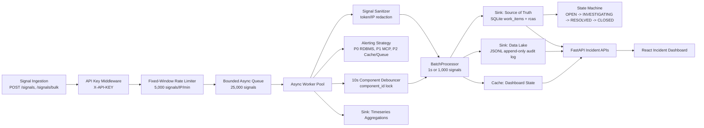

# Mission-Critical Incident Management System

This repository implements an async Incident Management System for distributed-stack failures across APIs, MCP hosts, caches, queues, RDBMS, and NoSQL stores. It is built with a production SRE mindset: bounded memory, explicit backpressure, batched persistence, debounced incident creation, separated data sinks, mandatory RCA, MTTR calculation, security on ingestion, and operational metrics.

## Tech Stack

- Backend: Python 3.14, FastAPI, asyncio, Pydantic, SQLAlchemy Core schemas, SQLite, JSONL, prometheus-client, pytest, Uvicorn.
- Frontend: React 19, Vite, JSX, CSS, lucide-react.
- Runtime: Docker Compose with restart policies and a named data volume.
- Security: `X-API-KEY` or `Authorization: Bearer ...` for signal ingestion.
- Persistence:
  - Data Lake: append-only JSONL raw signal audit log.
  - Source of Truth: SQLite `work_items` and `rcas`.
  - Hot Path Cache: in-memory active incident cache.
  - Aggregations: in-memory minute buckets by component type.

## Architecture Diagram



## Core Approach

The ingestion API validates signals with Pydantic, enforces API-key authentication and rate limiting, then admits traffic into a bounded async queue. Worker tasks drain the queue, classify alert severity with a Strategy pattern, debounce repeated component failures, sanitize sensitive payload values, and hand raw records to the `BatchProcessor`.

The `BatchProcessor` is the high-throughput persistence layer. It flushes when either condition is met:

- The internal buffer reaches `1,000` signals.
- `1 second` has elapsed.

On flush, raw records are appended to JSONL and SQLite receives grouped signal-count updates by work item.

## The SRE Why: Backpressure

The backend uses a bounded `asyncio.Queue(maxsize=25000)`.

If persistence or workers slow down, the queue absorbs a short burst. If the queue fills, the system rejects new ingestion immediately with:

```text
503 Service Unavailable
```

That response pushes pressure back to the sender instead of letting memory grow without bound. This is intentional overload behavior: degrade explicitly, preserve process health, and avoid data-loss-by-crash.

The API also has fixed-window rate limiting:

```text
5,000 signals per IP per minute
```

When a client exceeds that limit, the API returns:

```text
429 Too Many Requests
```

## The SRE Why: Batching

At 10,000 signals/sec, writing every signal directly to SQLite would create lock contention, high fsync pressure, and tail latency spikes. The IMS batches raw signal persistence and grouped count deltas.

JSONL was chosen for the Data Lake because it is append-only. On a single-node system, append-only writes are one of the fastest and simplest ways to persist high-volume raw events while preserving an audit trail.

Before JSONL persistence, the ingestion worker redacts internal IPs, bearer tokens, API keys, passwords, and secret-like payload fields.

## Design Patterns

### Strategy Pattern: Alerting

Component-specific alert severity and routing live behind `AlertingStrategy`.

Examples:

- RDBMS failure -> P0 -> database on-call.
- MCP host failure -> P1 -> MCP host on-call.
- Cache failure -> P2 -> cache responder.
- Queue failure -> P2 -> async platform channel.

File: `backend/app/alerting.py`

### State Pattern: Workflow

Incident lifecycle is implemented with state objects:

```text
OPEN -> INVESTIGATING -> RESOLVED -> CLOSED
```

The State Machine rejects invalid transitions and enforces RCA before closure.

File: `backend/app/workflow.py`

## RCA and MTTR

RCA is mandatory before an incident can move to `CLOSED`.

RCA validation:

- `incident_end >= incident_start`
- `incident_end` cannot be in the future
- root cause, fix, and prevention text must be meaningful

Per-incident MTTR:

```text
incident_end - incident_start
```

Overall MTTR formula:

```text
MTTR = sum(Resolution Timestamp - Incident Start Timestamp) / Total Incidents Resolved
```

The system persists `mttr_seconds` on both the RCA record and the `work_items` table.

## Observability

Health:

```text
GET /health
```

Returns status, queue depth/capacity, pending batch size, uptime, memory usage, storage connectivity, and ingestion counters.

Prometheus:

```text
GET /metrics
```

Metrics:

- `signals_ingested_total`
- `signals_dropped_total`
- `incident_resolution_time_seconds`

Console pulse every 5 seconds:

```text
[IMS PULSE] TPS: {x} | Queue: {y}/25000 | Batched: {z} | Dropped: {w}
```

## API Summary

```text
GET    /health
GET    /metrics
POST   /signals
POST   /signals/bulk
GET    /incidents
GET    /incidents/{work_item_id}
PATCH  /incidents/{work_item_id}/status
POST   /incidents/{work_item_id}/rca
GET    /aggregations
```

## Docker Compose

### Fast Reviewer Quickstart

Use this path if you want to verify the complete project quickly.

1. Start the production profile:

```bash
IMS_API_KEY=dev-secret docker compose -f docker-compose.production.yml up --build
```

2. Open the app:

```text
Frontend dashboard: http://localhost:5173
Backend landing:    http://localhost:8000
Health check:       http://localhost:8000/health
Metrics endpoint:   http://localhost:8000/metrics
Prometheus:         http://localhost:9090
```

3. Seed incidents:

```bash
cd backend
python3 scripts/simulate_failure.py --base-url http://localhost:8000 --api-key dev-secret --rate 1000 --duration 1 --batch-size 500
```

4. Refresh `http://localhost:5173`.

Expected result:

- One `P0` incident for `RDBMS_PRIMARY_01`.
- One `P1` incident for `MCP_HOST_EAST_02`.
- Raw signals visible in the incident detail panel.
- RCA form and workflow controls visible.

5. Test the workflow in the UI:

- Click `INVESTIGATING`.
- Click `RESOLVED`.
- Fill the RCA form.
- Click `Submit RCA`.
- Click `CLOSED`.

The incident should leave the active feed. Closed incidents are still available from:

```bash
curl "http://localhost:8000/incidents?include_closed=true"
```

6. Query Prometheus at `http://localhost:9090/query`.

Useful queries:

```text
signals_ingested_total
signals_dropped_total
rate(signals_ingested_total[1m])
incident_resolution_time_seconds_count
up
```

### Default Local Compose

```bash
docker compose up --build
```

Services:

- Backend: `http://localhost:8000`
- Frontend: `http://localhost:5173`
- Health: `http://localhost:8000/health`
- Metrics: `http://localhost:8000/metrics`

Runtime data is stored in the named Docker volume `ims-data`, mounted at `/app/data`. SQLite and JSONL survive `docker compose down`; they are deleted only by `docker compose down -v`.

Production-profile compose:

```bash
IMS_API_KEY=dev-secret docker compose -f docker-compose.production.yml up --build
```

This adds Redis-backed hot cache/aggregation state through `REDIS_URL` and Prometheus scraping of `/metrics`.

If you omit `IMS_API_KEY=dev-secret`, the production compose file falls back to `change-me`. In that case, pass `--api-key change-me` to the scripts.

## Local Development

Backend:

```bash
cd backend
python3 -m venv .venv
source .venv/bin/activate
pip install -r requirements.txt
uvicorn app.main:app --reload
```

Frontend:

```bash
cd frontend
npm install
npm run dev
```

## Ingestion API Key

Set:

```bash
export IMS_API_KEY=dev-secret
```

Send:

```text
X-API-KEY: dev-secret
```

or:

```text
Authorization: Bearer dev-secret
```

## Simulate Failure Events

```bash
cd backend
python3 scripts/simulate_failure.py --base-url http://localhost:8000 --rate 10000 --duration 5 --api-key dev-secret
```

## Chaos and Burst Load Test

Send 50,000 signals over 5 seconds:

```bash
cd backend
python3 scripts/load_test.py --base-url http://localhost:8000 --burst --scenario RDBMS_FLAP --api-key dev-secret
```

Scenarios:

- `RDBMS_FLAP`: alternating database failure and recovery-like signals.
- `MCP_OUTAGE`: concentrated MCP host outage.
- `MIXED_STACK`: mixed database and cache failure traffic.

## Tests

```bash
cd backend
pytest
```

Expected result:

```text
13 passed
```

Coverage includes:

- Alerting Strategy behavior.
- RCA validation, including future end-time rejection.
- Mandatory RCA before closure.
- Batch flush behavior.
- Queue backpressure behavior.
- Audit event persistence for workflow timeline.
- API key rejection.
- Signal sanitization.
- Health and Prometheus metrics endpoints.

## Production Upgrade Path

This assessment implementation uses local single-node substitutes while preserving production boundaries.

Recommended replacements:

- Async queue: Kafka, NATS, Pulsar, or Redpanda.
- Raw Data Lake: S3, ClickHouse, OpenSearch, or BigQuery.
- Source of Truth: PostgreSQL.
- Hot Cache: Redis.
- Aggregations: Prometheus, VictoriaMetrics, TimescaleDB, or ClickHouse.
- Alerting: PagerDuty, Opsgenie, Slack, or incident.io.
